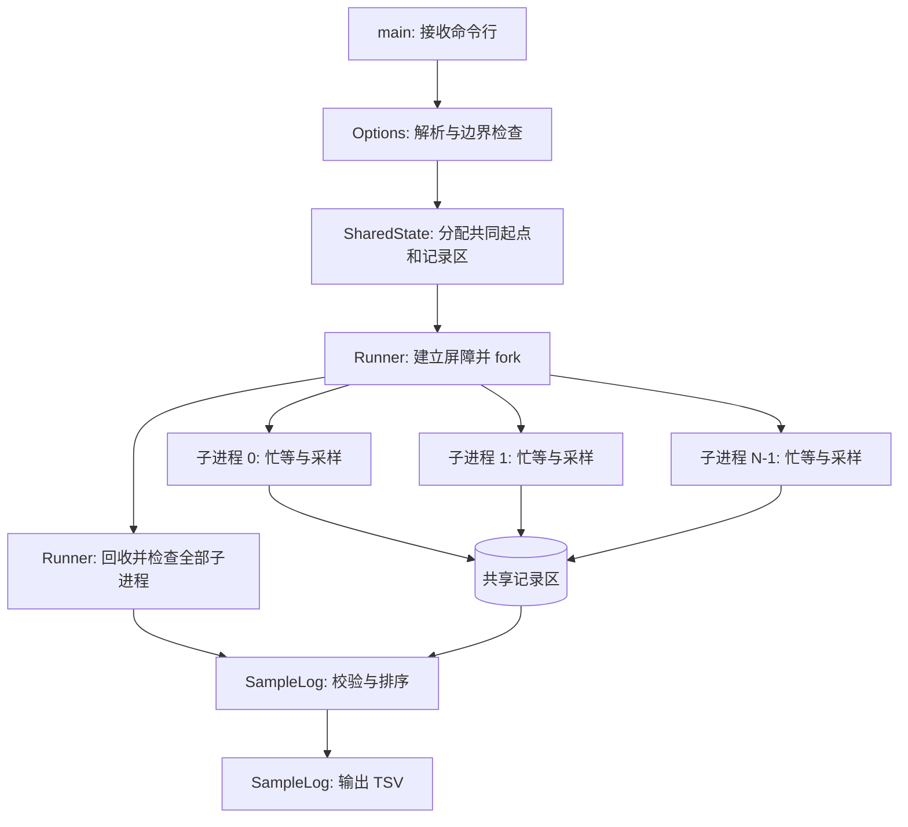
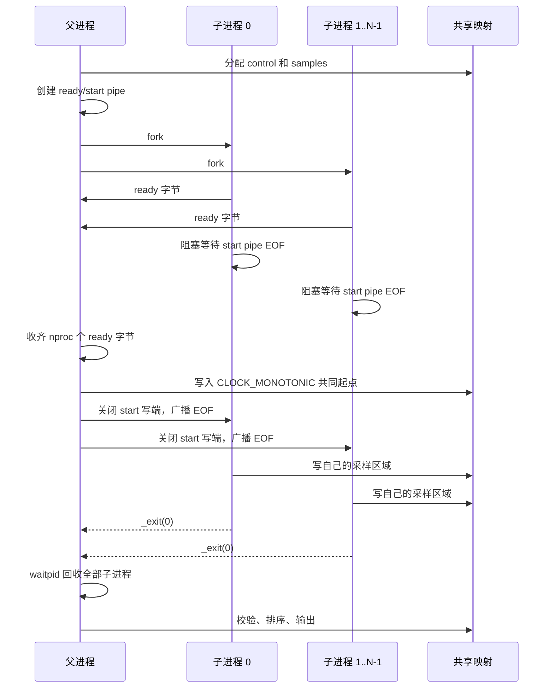
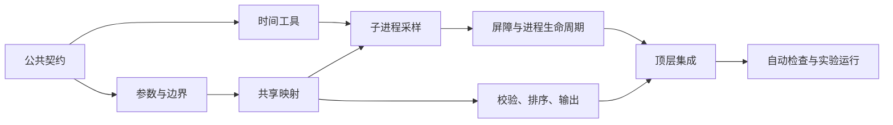

# simple-sched-lab 详细设计与实施清单

本文把 [`experiment.md`](experiment.md) 定义的实验契约落实为可实现、可审查、
可验收的程序设计。C 是基准实现；C++17 独立实现相同行为，用于对照系统编程
方式。两套代码不互相包含源码。

## 1. 设计目标

### 1.1 必须做到

- 创建真正的进程，不用线程代替。
- 每个子进程完成相同数量的 CPU 工作。
- 所有子进程使用同一个经过时间起点。
- 忙等期间不休眠、不输出、不分配内存。
- 成功输出必须完整、顺序确定并能直接作为 TSV 读取。
- 参数错误、部分 `fork` 失败、子进程失败和系统调用中断都有明确处理。
- 父进程在所有路径上关闭资源并回收已创建的全部子进程。
- C 和 C++ 版本具有相同的命令行、退出语义和输出格式。

### 1.2 不在基础实现中解决

- 不直接读取调度器内部状态。
- 不测量准确的上下文切换时间或调度时间片。
- 不在程序内部设置 nice、实时策略或 CPU 亲和性。
- 不自动调用 `taskset`、`perf` 或绘图工具。
- 不要求两个进程严格交替或获得完全相同的短期 CPU 份额。
- 不把 C 与 C++ 抽成跨目录的共享库。

这些内容可以在基础实验稳定后作为扩展加入。

## 2. 已确定的设计决策

| 问题 | 选择 | 原因 |
| --- | --- | --- |
| CPU 工作量怎样计量 | `CLOCK_PROCESS_CPUTIME_ID` + 绝对目标 | 不依赖 CPU 频率标定，等待调度时不增加，并避免分段误差累积。 |
| 经过时间怎样计量 | `CLOCK_MONOTONIC` | 不受系统墙上时间调整影响。 |
| 怎样减少 `fork` 顺序偏差 | ready/start 双管道屏障 | 所有子进程就绪后才设置共同起点并开始。 |
| 记录保存在哪里 | `fork` 前建立的共享匿名 `mmap` | 子进程不需要并发打印，也不受 pipe 容量限制。 |
| 是否需要锁 | 不需要 | 每个子进程只写由 `id` 决定的独占记录区。 |
| 谁负责输出 | 父进程 | 可以先确认全部成功，再统一校验、排序和输出。 |
| 输出顺序 | `elapsed_ns`、`id`、`progress` 依次排序 | 便于作图；时间相同时仍有确定顺序。 |
| 子进程怎样退出 | `_exit` | 不刷新从父进程复制的 stdio/iostream 缓冲，也不依赖 C++ 析构。 |
| 失败时是否保留部分数据 | 不保留 | 半份 TSV 容易被误认为有效实验结果。 |

基础实现不使用书中的循环次数标定法。循环标定保留为扩展实验，用来比较计量方法
对编译优化、CPU 频率和系统负载的敏感程度。

## 3. 总体架构



### 3.1 父子进程时序



## 4. 数据与边界

### 4.1 参数模型

解析完成后使用无符号 64 位整数保存用户提供的毫秒值，使用 `size_t` 保存已验证
可放入内存的计数和字节数。

基础实现采用以下上限，两种语言必须一致：

| 项目 | 上限 | 目的 |
| --- | ---: | --- |
| `nproc` | 256 | 避免意外创建极端数量的进程。 |
| `total` | 3,600,000 ms | 单个进程最多一小时 CPU 工作。 |
| `nrecord` | 100,000 / 进程 | 限制单进程采样数量。 |
| 全部共享映射 | 256 MiB | 限制 `nproc * nrecord` 的总内存。 |

检查顺序：

1. 参数个数必须为 3。
2. 每个参数必须是完整的十进制正整数，不接受符号、空字符串或尾随字符。
3. 检查 `nproc` 和 `total` 上限。
4. 检查 `resol <= total` 和 `total % resol == 0`。
5. 计算 `nrecord`，检查单进程记录上限。
6. 用除法先行或安全乘法检查总记录数与映射字节数，禁止先溢出再比较。

### 4.2 记录模型

逻辑记录定义为：

```text
SampleRecord
├── id: uint32
├── progress: uint32
└── elapsed_ns: int64
```

每条记录固定 16 字节；C 使用静态断言，C++ 使用 `static_assert` 验证。内部保存
纳秒，避免过早丢失精度。输出 `elapsed_ms` 时写成：

```text
<整数毫秒>.<六位小数>
```

例如 `50127384 ns` 输出为 `50.127384 ms`。

第 `id` 个进程的记录范围为：

```text
samples[id * nrecord ... (id + 1) * nrecord - 1]
```

每个子进程只写自己的范围，因此没有数据竞争。父进程只在所有子进程结束后读取。

### 4.3 共享映射

使用两个 `MAP_SHARED | MAP_ANONYMOUS` 映射：

1. `SharedControl`：保存共同的 `struct timespec start_time`。
2. `SampleRecord[]`：保存全部采样记录。

两个映射都在第一次 `fork` 前建立。在 C++17 中，父进程需在原始映射上显式开始
平凡对象的生命周期，再进行 `fork`；不能直接把未建立对象生命周期的字节解释成
对象。映射只由父进程在所有子进程回收后 `munmap`。

## 5. 时钟与采样算法

### 5.1 时间表示

内部统一使用 `int64_t` 纳秒。提供以下操作：

- 将合法的 `timespec` 转成纳秒，并检查乘法和加法溢出。
- 计算两个单调时钟值的非负差。
- 把毫秒安全转换成纳秒。
- 把纳秒格式化为毫秒整数部分和六位小数部分。

### 5.2 子进程算法

子进程释放开始屏障后执行：

```text
读取共享的 monotonic_start
读取 process_cpu_start

for i = 0 .. nrecord - 1:
    target = process_cpu_start + (i + 1) * resol_ns
    do:
        读取 CLOCK_PROCESS_CPUTIME_ID
    while process_cpu_now < target

    读取 CLOCK_MONOTONIC
    record.id = child_id
    record.elapsed_ns = monotonic_now - monotonic_start
    record.progress = (i + 1) * 100 / nrecord

_exit(0)
```

目标必须基于 `process_cpu_start` 的绝对偏移，不能每轮以“当前值 + resol”作为下个
目标。进度乘法使用足够宽的类型。最后一条记录必须显式验证为 100。

忙等路径允许的操作只有读取时钟、整数计算和写本进程记录区。禁止：

- `sleep`、`nanosleep` 或阻塞 I/O。
- `printf`、iostream 或日志输出。
- `malloc`、`new` 或容器扩容。
- 修改其它进程的记录区域。

## 6. 进程与资源生命周期

### 6.1 初始化顺序

父进程按以下顺序获取资源：

1. 解析并验证参数。
2. 分配 PID 和状态数组。
3. 建立 control 和 samples 映射。
4. 创建 ready pipe。
5. 创建 start pipe。
6. 逐个 `fork` 子进程并保存 PID。

失败清理必须按照相反方向执行。

### 6.2 开始屏障

管道端约定：

| 角色 | ready pipe | start pipe |
| --- | --- | --- |
| 父进程 | 只读 | 只写，发布开始时关闭写端 |
| 子进程 | 写一个字节后关闭 | 只读，读到 EOF 后开始 |

子进程必须先关闭不使用的管道端，再写 ready 字节。父进程在所有 `fork` 成功后
关闭自己的 ready 写端和 start 读端，然后读取恰好 `nproc` 个 ready 字节。

若 ready pipe 在收齐字节前出现 EOF，说明至少一个子进程提前退出。父进程进入
失败收口，不发布正常开始信号。

父进程收齐 ready 字节后：

1. 读取 `CLOCK_MONOTONIC`。
2. 写入共享 `start_time`。
3. 关闭 start pipe 写端。

所有阻塞读取都会观察到 EOF，然后开始工作。它减少启动偏差，但不承诺硬实时的
同时运行。

### 6.3 正常回收

父进程使用 `waitpid(-1, ...)` 回收任意已结束子进程，并根据 PID 更新状态数组。
`waitpid` 被 `EINTR` 中断时重试。父进程必须验证：

- 返回的 PID 属于已创建集合。
- 每个 PID 只回收一次。
- 子进程通过正常退出结束。
- 子进程退出状态为 0。

全部成功后才能读取、校验和输出共享记录。

### 6.4 失败收口

| 失败位置 | 处理方式 |
| --- | --- |
| 参数、分配、`mmap`、`pipe` 失败 | 尚未创建子进程；逆序释放已有资源并退出。 |
| 第 `k` 次 `fork` 失败 | 保持开始屏障关闭，向已创建子进程发送 `SIGKILL`，关闭管道并逐个 `waitpid`。 |
| ready 阶段提前 EOF | 向仍存活子进程发送 `SIGKILL`，回收全部已创建子进程。 |
| 父进程设置共同起点失败 | 不释放正常开始屏障；终止并回收全部子进程。 |
| 某子进程运行失败或被信号终止 | 立即向尚未回收的子进程发送 `SIGKILL`，继续回收全部进程。 |
| 父进程输出失败 | 报告 stdout 错误；输出可能已部分写出，返回运行时错误。 |

发送终止信号时，`kill` 返回 `ESRCH` 表示目标已经退出，可以继续回收；其它错误
要记录，但不能因此跳过剩余 PID。任何失败路径都不能只等待一个子进程后直接返回。

### 6.5 退出状态

| 状态 | 含义 |
| ---: | --- |
| 0 | 实验成功，stdout 包含完整 TSV。 |
| 1 | 运行时或系统调用失败。 |
| 2 | 命令行参数错误。 |

子进程可以使用内部非零状态区分屏障、时钟等失败；这些内部值不属于对外契约。
父进程对外统一返回 1，并在 stderr 指出失败阶段和相关 PID。

## 7. 结果校验与输出

父进程在输出前检查每个进程的记录区域：

- `id` 等于区域所属进程编号。
- `elapsed_ns >= 0`。
- 同一进程的 `elapsed_ns` 非递减。
- `progress` 等于 `(i + 1) * 100 / nrecord`。
- 最后一条 `progress == 100`。

校验通过后，按以下键排序全部记录：

```text
(elapsed_ns, id, progress)
```

先完成所有运行结果校验，再向 stdout 写表头。每行使用一次格式化输出，结束时
检查输出函数和 `fflush(stdout)` 的返回值。stderr 不能混入 stdout。

## 8. 模块划分

### 8.1 C 版本

| 文件 | 职责 | 不负责 |
| --- | --- | --- |
| `main.c` | 调用顶层流程，把内部错误转换为进程退出状态。 | 参数细节、忙等循环、资源清理实现。 |
| `options.c/.h` | 参数解析、范围与内存预算检查。 | 创建任何进程或映射。 |
| `time_util.c/.h` | 时钟读取、纳秒换算、时间差。 | 实验控制流。 |
| `shared_state.c/.h` | 映射大小计算、`mmap`、记录区寻址、`munmap`。 | `fork` 和输出。 |
| `runner.c/.h` | 管道、屏障、`fork`、子进程工作、终止和回收。 | TSV 格式化。 |
| `sample_log.c/.h` | 记录校验、排序和 TSV 输出。 | 进程生命周期。 |

公开 C 符号使用 `sched_lab_` 前缀；仅文件内使用的函数为 `static`。动作函数遵循
成功返回 0、失败返回负 errno 的约定。

### 8.2 C++17 版本

| 文件 | 职责 | 主要类型或函数 |
| --- | --- | --- |
| `main.cpp` | 顶层流程和退出状态转换。 | `main()` |
| `options.cpp/.h` | 参数和资源边界。 | `Options`, `ParseOptions()` |
| `time_util.cpp/.h` | 时钟和安全时间换算。 | `ReadClockNs()`, `ElapsedNs()` |
| `shared_state.cpp/.h` | 映射所有权和记录区访问。 | `SharedState` |
| `runner.cpp/.h` | 进程生命周期与子进程路径。 | `Runner`, `RunChild()` |
| `sample_log.cpp/.h` | 校验、排序和输出。 | `ValidateSamples()`, `PrintSamples()` |

父进程使用 RAII 管理 fd、映射和普通内存。`fork` 后的子进程路径不依赖 RAII
析构完成清理，显式关闭 fd 后用 `_exit`。不使用异常，失败通过状态值返回。

## 9. 实施依赖



必须先完成并固定 C 版外部行为，再实现 C++ 对照版。不要同时猜测两套尚未验证的
行为。

## 10. 完整任务清单

任务按依赖顺序执行。每个任务都列出工作内容、完成条件和依赖；只有完成条件能够
被检查时才勾选。四个阶段的出口如下：

| 阶段 | 主要产物 | 阶段出口 |
| --- | --- | --- |
| 0：公共契约 | 实验说明和详细设计 | 两种语言不再自行决定外部行为。 |
| 1：C 基准 | 可运行的 `sched_c` | C 版通过契约检查和 A/B 实验。 |
| 2：C++ 对照 | 可运行的 `sched_cpp` | C++ 版通过相同检查，并与 C 行为一致。 |
| 3：实验交付 | TSV、图、环境和结论 | Definition of Done 全部满足。 |

### 10.1 阶段 0：冻结公共契约

- [x] **DOC-01：定义实验问题与结论边界**
  - 完成内容：CPU 时间、经过时间、实验变量、A/B/C/D 对照和不可推导结论。
  - 完成条件：`experiment.md` 能独立说明为什么做和怎样解释结果。
- [x] **DOC-02：定义命令行与 TSV 契约**
  - 完成内容：三个参数、三列输出、表头、排序、退出状态。
  - 完成条件：C 和 C++ 不需要自行决定外部行为。
- [x] **DOC-03：确定进程、计时、屏障和共享映射方案**
  - 完成内容：本文件第 2 至第 7 节。
  - 完成条件：实现阶段没有待选的 IPC 或计时分支。

### 10.2 阶段 1：C 基准实现

- [ ] **C-01：建立文件和构建骨架**
  - 新增第 8.1 节列出的 `.c/.h` 文件。
  - 更新 `sched_c/CMakeLists.txt`，全部源文件只属于 `sched_c` 目标。
  - 统一 `CMakePresets.json` 的 schema 版本与项目声明的最低 CMake 版本；当前
    schema 版本 8 无法被 CMake 3.22.1 读取，不能把不可执行的 preset 留给实验者。
  - 加入必要的 POSIX feature-test macro；保持 GNU C11、`-Wall -Wextra`。
  - 完成条件：空骨架能够配置、构建且无 warning。
  - 依赖：DOC-03。

- [ ] **C-02：实现参数解析和资源预算**
  - 使用 `strtoull` 或等价的严格解析，检查 `errno`、结束指针和所有边界。
  - 实现安全乘法，计算 `nrecord`、总记录数和映射字节数。
  - 参数错误返回统一状态，stderr 指出具体参数和原因。
  - 完成条件：第 11.1 节全部非法参数用例通过，错误时 stdout 为空。
  - 依赖：C-01。

- [ ] **C-03：实现时间工具**
  - 封装 `clock_gettime`，实现毫秒转纳秒、`timespec` 转纳秒和非负时间差。
  - 检查整数溢出与单调时钟倒退这一内部异常。
  - 完成条件：边界值和纳秒借位测试通过；调用方不直接重复时间换算。
  - 依赖：C-01。

- [ ] **C-04：实现共享映射**
  - 建立 control 和 samples 两个共享匿名映射。
  - 实现按 `id` 获取独占记录区，验证 16 字节记录布局。
  - 所有部分失败路径正确 `munmap`。
  - 完成条件：最小和最大允许配置都能正确计算映射范围，无越界和泄漏。
  - 依赖：C-02。

- [ ] **C-05：实现可靠的 fd 辅助函数和开始屏障**
  - 建立 ready/start pipe，明确父子各自关闭哪些端。
  - `read`、`write` 遇到 `EINTR` 时重试；`close` 在 Linux 上不得因 `EINTR`
    盲目重试，以免误关复用后的 fd；ready 计数必须精确。
  - start pipe 仅通过父进程关闭写端广播 EOF。
  - 完成条件：多个空子进程都在父进程设置共同起点之后越过屏障，程序不挂起。
  - 依赖：C-01。

- [ ] **C-06：实现单个子进程的忙等与采样**
  - 使用进程 CPU 时钟的绝对目标。
  - 每次目标完成后读取单调时钟并填写指定记录区。
  - 子进程不打印、不分配、不休眠，最终 `_exit`。
  - 完成条件：`nproc=1` 时记录数、id、进度和时间单调性正确。
  - 依赖：C-03、C-04、C-05。

- [ ] **C-07：实现创建、部分创建失败和 ready 失败收口**
  - 保存每个 PID 和生命周期状态。
  - `fork` 失败时杀死并回收此前创建的所有子进程。
  - ready 提前 EOF 时执行相同的完整收口。
  - 完成条件：故障注入后无存活子进程、无僵尸、无 fd 或映射泄漏。
  - 依赖：C-05、C-06。

- [ ] **C-08：实现运行阶段回收和失败传播**
  - 用 `waitpid(-1, ...)` 回收，处理 `EINTR`、正常退出和信号终止。
  - 任一子进程失败时终止仍运行的子进程，并继续回收全部 PID。
  - 完成条件：成功时每个 PID 恰好回收一次；失败时 stdout 为空。
  - 依赖：C-07。

- [ ] **C-09：实现记录校验、排序和 TSV 输出**
  - 检查第 7 节所有记录不变量。
  - 按 `(elapsed_ns, id, progress)` 排序。
  - 精确输出表头和六位小数毫秒，检查 stdout 错误。
  - 完成条件：第 11.2 节格式与内容检查全部通过。
  - 依赖：C-04。

- [ ] **C-10：集成顶层流程和统一清理**
  - `main` 只编排解析、运行、输出和退出状态映射。
  - 所有获取资源的位置都有对应清理路径。
  - 完成条件：正常、参数错误和运行错误分别返回 0、2、1。
  - 依赖：C-02、C-08、C-09。

- [ ] **C-11：建立可复用的黑盒契约检查**
  - 新增一个同时适用于 C/C++ 二进制的检查脚本，位置和依赖写入脚本说明。
  - 覆盖第 11.1 节参数矩阵，并解析 TSV 检查第 11.2 节全部确定性不变量。
  - 时间比例只输出为实验数据，不在脚本中设置固定倍数断言。
  - 完成条件：脚本能接收待测二进制路径，成功识别一份正确输出和人为构造的
    错误退出状态、错误列数、错误记录数、错误进度及错误排序。
  - 依赖：C-10。

- [ ] **C-12：完成 C 版工程验收**
  - 运行格式化、干净构建、黑盒契约检查和 A/B 实验。
  - 检查 `-Wall -Wextra` 输出、残留进程和资源错误。
  - 完成条件：第 11 节中适用于 C 的项目全部通过并保存结果。
  - 依赖：C-11。

### 10.3 阶段 2：C++17 对照实现

- [ ] **CPP-01：建立 C++ 文件和构建骨架**
  - 新增第 8.2 节列出的 `.cpp/.h` 文件。
  - 更新 `sched_cpp/CMakeLists.txt`；保持 C++17、`-Wall -Wextra`、无异常设计。
  - 完成条件：空骨架能够独立配置、构建且无 warning。
  - 依赖：C-12。

- [ ] **CPP-02：实现 Options 与安全资源计算**
  - 复现 C-02 的完整输入集合、边界和错误类别。
  - 不允许隐式窄化或有符号/无符号环绕。
  - 完成条件：同一非法输入在 C 和 C++ 中具有相同退出状态和等价原因。
  - 依赖：CPP-01。

- [ ] **CPP-03：实现时间工具**
  - 复现 C-03 的纳秒表示、溢出检查和错误语义。
  - 不使用 C++20 chrono 特性。
  - 完成条件：与 C 版使用同一组边界测试通过。
  - 依赖：CPP-01。

- [ ] **CPP-04：实现 fd 与共享映射 RAII 类型**
  - 父进程对象负责唯一所有权、移动和析构释放。
  - 在映射中正确建立平凡对象生命周期。
  - 明确 `fork` 后子进程显式关闭路径，不依赖析构。
  - 完成条件：成功和构造中途失败都无 fd 或映射泄漏。
  - 依赖：CPP-02。

- [ ] **CPP-05：实现屏障和子进程采样**
  - 行为与 C-05、C-06 一致。
  - 子进程路径不使用 iostream、动态分配或异常。
  - 完成条件：单进程输出内容满足公共契约。
  - 依赖：CPP-03、CPP-04。

- [ ] **CPP-06：实现 Runner 生命周期和失败收口**
  - 行为与 C-07、C-08 一致。
  - 管理 PID 状态，任一失败后终止并回收其余子进程。
  - 完成条件：故障路径无存活子进程、僵尸或资源泄漏。
  - 依赖：CPP-05。

- [ ] **CPP-07：实现校验、排序和输出**
  - 复现 C-09 的不变量、排序键、精度和 stdout 错误检查。
  - 完成条件：相同参数下，两套程序的表头、记录数量、id 和 progress 完全一致。
  - 依赖：CPP-04。

- [ ] **CPP-08：集成和工程验收**
  - 完成顶层编排、格式化和干净构建，并把 C-11 的同一黑盒脚本用于 C++ 二进制。
  - 完成第 11 节检查和 A/B 实验。
  - 完成条件：C++ 版独立通过全部契约测试和 A/B 实验。
  - 依赖：CPP-02、CPP-06、CPP-07。

### 10.4 阶段 3：实验与交付

- [ ] **EXP-01：建立实验结果目录和环境记录**
  - 保存内核版本、逻辑 CPU 数、允许 CPU 集合、虚拟化或容器信息。
  - 完成条件：别人能够判断实验实际使用了哪些 CPU 资源。
  - 依赖：C-12、CPP-08。

- [ ] **EXP-02：完成 C 版 A/B/C 数据采集**
  - 每组至少运行 3 次；C 在环境不支持多核时注明跳过原因。
  - 完成条件：原始 TSV、完整命令和关键完成时间均已保存。
  - 依赖：EXP-01。

- [ ] **EXP-03：完成 C++ 对照数据采集**
  - 使用与 C 相同的参数、CPU 亲和性和相近环境。
  - 完成条件：记录数和趋势与 C 版一致，差异得到说明。
  - 依赖：EXP-02。

- [ ] **EXP-04：生成两张图并写结论**
  - 提供可重复运行的绘图脚本，输入 TSV，生成采样时间散点图和分进程进度曲线。
  - 脚本依赖、调用方法、图例和坐标单位写入结果说明。
  - 按 `experiment.md` 第 2.7 节模板填写关键数值。
  - 完成条件：结论区分观测事实、解释和需要额外工具验证的推测。
  - 依赖：EXP-02、EXP-03。

- [ ] **EXP-05：最终仓库验收**
  - 从干净构建目录重新构建两套程序。
  - 检查文档命令、二进制路径、输出示例和实际实现一致。
  - 完成条件：第 12 节 Definition of Done 全部满足。
  - 依赖：EXP-04。

## 11. 验证矩阵

### 11.1 参数和退出状态

对 C 和 C++ 二进制分别运行：

| 输入 | 期望退出状态 | 期望输出 |
| --- | ---: | --- |
| 无参数、少参数、多参数 | 2 | stderr 有用法；stdout 空。 |
| `x 100 10` | 2 | 指出 `nproc` 非法。 |
| `0 100 10` | 2 | 指出 `nproc` 必须为正。 |
| `1 -100 10` | 2 | 拒绝带符号输入。 |
| `1 100x 10` | 2 | 拒绝尾随字符。 |
| `1 100 0` | 2 | 指出 `resol` 必须为正。 |
| `1 10 20` | 2 | 指出 `resol <= total`。 |
| `1 100 30` | 2 | 指出整除要求。 |
| 超过任一设计上限 | 2 | 指出对应资源边界。 |
| `1 100 20` | 0 | 表头加 5 条记录。 |
| `2 100 20` | 0 | 表头加 10 条记录。 |

### 11.2 成功输出不变量

对任一成功 TSV 检查：

- [ ] 表头严格为 `id\telapsed_ms\tprogress`。
- [ ] 除表头外，每行恰好三列。
- [ ] 总记录数等于 `nproc * total / resol`。
- [ ] 每个 `id` 的记录数都等于 `total / resol`。
- [ ] 每个 `id` 的进度符合公式且最后为 100。
- [ ] `elapsed_ms` 是非负、含六位小数的数字。
- [ ] 全文件记录按规定键排序。
- [ ] stderr 为空。

### 11.3 生命周期和资源

- [ ] 正常结束后所有子进程都已回收。
- [ ] 部分 `fork` 失败后，已经创建的子进程全部终止并回收。
- [ ] 子进程时钟失败后，其余子进程被终止并全部回收。
- [ ] `read`、`write`、`waitpid` 遇到 `EINTR` 时不会把中断误判为永久失败。
- [ ] 所有成功和失败路径关闭两个 pipe 的全部 fd。
- [ ] 两块映射和父进程普通内存都被释放。
- [ ] 任一子进程失败时 stdout 为空。

不可稳定从外部触发的系统调用失败，可以通过临时测试替身或故障注入构建验证；
测试辅助代码不能进入正常实验路径。

### 11.4 实验语义

- [ ] `1 1000 50` 的最大经过时间与 1000 ms 同数量级。
- [ ] 绑定同一 CPU 的 `2 1000 50` 中两个 id 都到达 100%。
- [ ] 单核双进程的完成时间明显大于单进程基线。
- [ ] 环境提供至少两颗可用 CPU 时，不绑定双进程通常快于单核双进程。
- [ ] 相同条件下 C 与 C++ 的记录数量和总体趋势一致。

时间关系只作为实验观测，不写成要求固定倍数的脆弱自动化断言。

## 12. Definition of Done

只有同时满足以下条件，基础 lab 才算完成：

- [ ] 两套程序都能通过仓库 CMake preset 从干净目录构建，无 warning。
- [ ] 命令行、退出状态和 TSV 格式与 `experiment.md` 完全一致。
- [ ] 第 11.1、11.2 的确定性检查对两套程序全部通过。
- [ ] 第 11.3 的进程回收和资源清理路径已验证。
- [ ] C 和 C++ 都完成单进程与单核双进程实验。
- [ ] 环境允许时完成多核实验；否则记录无法执行的具体原因。
- [ ] 原始 TSV、环境信息、运行命令、两张图和结论文档齐全。
- [ ] 结论没有把采样点误写成上下文切换，也没有把一次实测写成调度器保证。
- [ ] `code_review_c.md` 和 `code_review_cpp.md` 的审查项全部满足。
